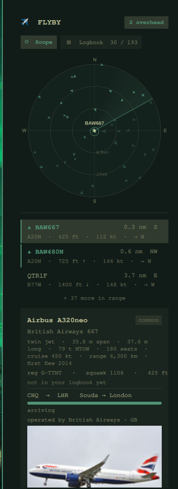

# Flyby

A bar widget that shows the aircraft flying over you on a live **radar scope**,
built from free community ADS-B data — and quietly keeps a **logbook** of every
aircraft type you've spotted.

Click the pill to open the scope: a sweeping radar with range rings and a blip
per aircraft, each drawn as a little silhouette for its class (widebody,
narrowbody, GA, helicopter, military…) and placed by real bearing and distance.
Click a blip — or press **N** — to pull up its **identity card**: the full type
name, the operator decoded from the callsign, and a spec sheet (wingspan,
weight, cruise, range, first-flight year) from bundled offline data. Unusual
traffic — military, vintage, rare airframes — is flagged.

Every type that crosses your range is added to the **Logbook** (press **L**, or
the toggle up top). New types raise a one-line "✦ new in your logbook" note.



## Install

```
omarchy plugin add https://github.com/Bert0424/omarchy-flyby.git
omarchy plugin enable bert.flyby
```

Then set your location (see below) and the scope fills in within a few seconds.

## Using it

- **Left click** the pill — open / close the popup.
- **Middle click** the pill — force an immediate refresh.
- **Click a blip** (or a list row) — select it and open its identity card.
- **Keys** (while the popup has focus): **L** toggles Scope / Logbook,
  **N** cycles the selection through the contacts nearest-first, **Esc** closes.
- The scope polls every 15 seconds while the shell is running.

### Footer controls (in the popup)

| Control | What it does |
|---|---|
| `📍 lat, lon` | Reopen the location form to fine-tune or re-enter your coordinates. |
| `5nm … 100nm` | Range of the scope (the outer ring). |
| `km` | Cycle distance units: km → mi → nm. |
| `🔕 / 🔔` | Notify when a new aircraft enters the overhead zone (within 3 km, airborne). |
| `air only / 🛬 ground` | Include or hide aircraft on the ground. Off by default. |
| `adsb.lol / adsb.fi` | Which community feed to query. |
| `○ flat / ◐ alt colour` | Colour radar blips by altitude (warm low → cool high). |
| `pill: callsign / type` | Whether the bar pill shows the closest callsign or its aircraft type. |

The new-type logbook note can be turned off in the widget's settings
(`Notify when a new aircraft type is logged`).

## Setting your location

Flyby needs your latitude and longitude in decimal degrees.

- **First run** — the popup shows a small form: type `lat` / `lon` and hit
  **Save**, or press **Locate me (approx)** for a one-shot coarse lookup from
  your public IP via `https://ipapi.co` (city-level; fine for a 25 nm scope).
- **Later** — tap the **📍 lat, lon** chip in the footer to reopen that form
  and fine-tune the coordinates by hand (IP lookup only gets you to the right
  city; for the "overhead" detection to be meaningful you want your real spot).
  Get exact coordinates from Google Maps: right-click your location, the lat/lon
  is at the top of the menu.
- The `Latitude` / `Longitude` fields in the widget's settings do the same thing.

## Data sources

- **adsb.lol** — `https://api.adsb.lol/v2/point/{lat}/{lon}/{radius_nm}`
- **adsb.fi** — `https://opendata.adsb.fi/api/v2/lat/{lat}/lon/{lon}/dist/{radius_nm}`

Both are free, community-run ADS-B aggregators. No account, no API key. Please be
a good citizen — the 15 s poll interval is deliberately gentle; don't crank it.

## What it does to your system

- **Network:** while enabled it makes one HTTPS GET every 15 seconds to the
  selected data source (`api.adsb.lol` or `opendata.adsb.fi`), sending only your
  configured latitude/longitude and range as part of the URL. If you press
  "Locate me", it additionally makes one HTTPS GET to `https://ipapi.co/latlong/`.
  Nothing else is sent anywhere.
- **No telemetry, no analytics, no accounts.**
- **No privilege escalation.** Runs entirely as your user — no polkit, no
  system services.
- **Files written:** exactly one of its own — `~/.local/state/omarchy/flyby-dex.json`,
  the logbook (which types you've seen, counts, first/last dates, and a rolling
  tail of the last 500 sightings). Written atomically and owner-only; the reader
  refuses symlinks and caps its input. "Clear logbook" in the Logbook view wipes
  it. Your coordinates / range / units / toggles are stored by Omarchy in
  `~/.config/omarchy/shell.json` like every other bar widget.
- **Bundled data:** `Data.js` — ~190 aircraft types and ~160 airline codes,
  static reference data compiled from public sources. Inert; no code runs from it.
- **Processes:** `curl` (the fetches) and `omarchy-notification-send` (only for
  the overhead / new-type notes, when you've enabled them).
- Every string that comes back from the API is stripped of markup and control
  characters and length-clamped before it is displayed.

## Uninstall

```
omarchy plugin disable bert.flyby   # or: omarchy plugin remove bert.flyby
```

It keeps nothing running in the background beyond the poll timer, which stops
with the widget. The logbook file is left in place; delete
`~/.local/state/omarchy/flyby-dex.json` yourself if you want it gone.

## Credits

Made by [@AlbertDIII](https://x.com/AlbertDIII).

## License

MIT
